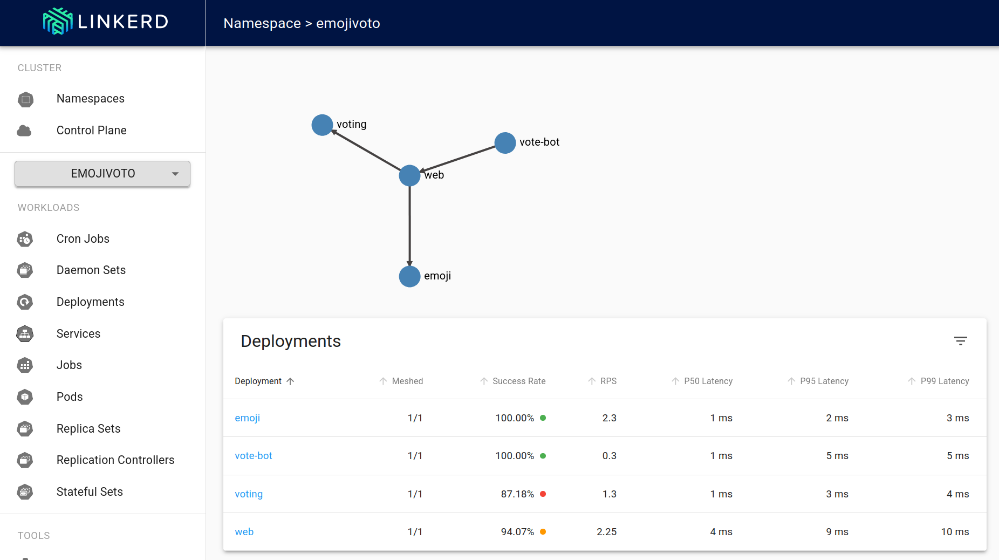

# Linkerd Service Mesh POC

Objective provide a dashboard that allow to monitor the service mesh. We want to implement :

- [x] Mesh Visualization
- [ ] Distributed Tracing
- [ ] mTls (Zero Trust)

This repository contains a Proof of Concept (POC) for setting up and testing Linkerd, a popular service mesh for Kubernetes. The POC demonstrates how to deploy Linkerd in a Kubernetes cluster, configure it for basic service-to-service communication, and explore its features such as observability, security, and reliability.


## Prerequisites

- A running Kubernetes cluster (Minikube, Kind, or a cloud provider)
- kubectl installed and configured to interact with your cluster
- Helm installed (optional, for easier installation of Linkerd)


## Provide a local Kubernetes cluster

You can use any flavor of kubernetes. I created a cluster with [Kind](https://kind.sigs.k8s.io/).

```bash
kind create cluster --name linkerd-poc
```

## Install Linkerd

Follow [those steps](https://linkerd.io/2.18/getting-started/) to install Linkerd in your Kubernetes cluster.
With those steps you should be able to see the dashboard that contain the visualization of the service mesh.



## Gateway Api

The Linkerd documentation should make you install the Gateway API CRDs. You can do it with:

```bash
kubectl apply -f https://github.com/kubernetes-sigs/gateway-api/releases/download/v1.2.1/standard-install.yaml
```
